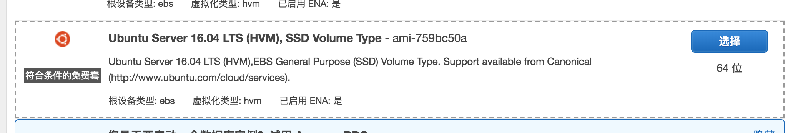
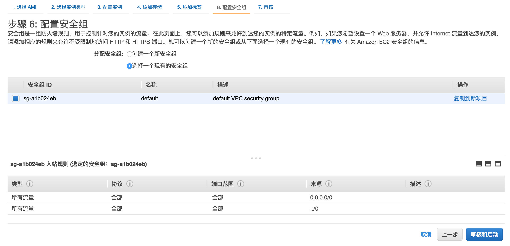
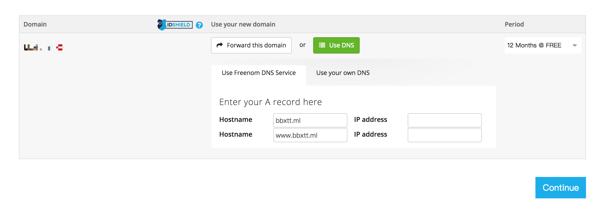
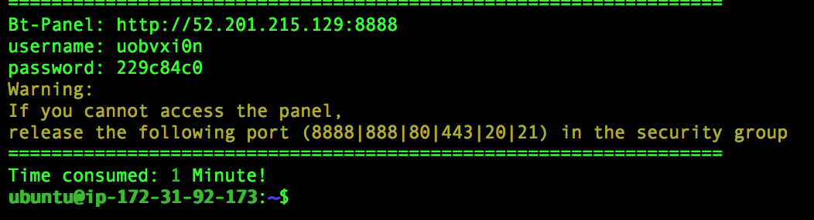
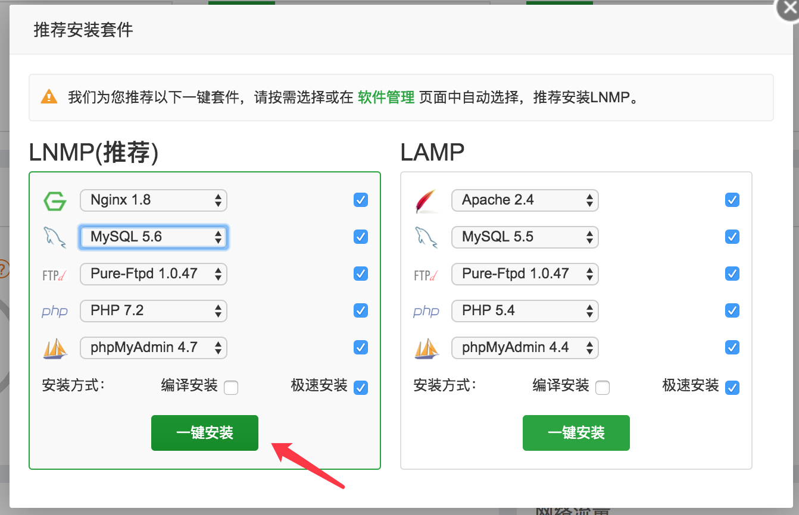
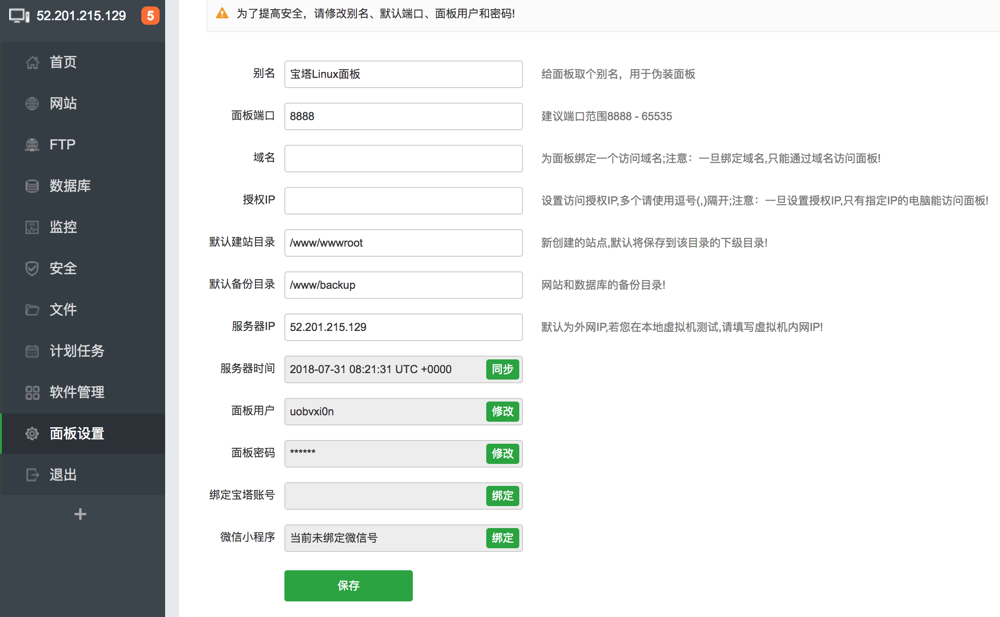
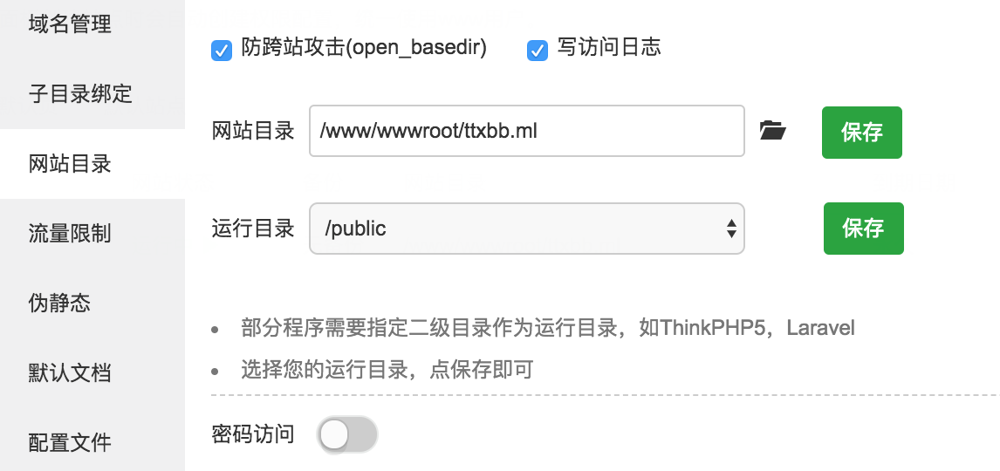
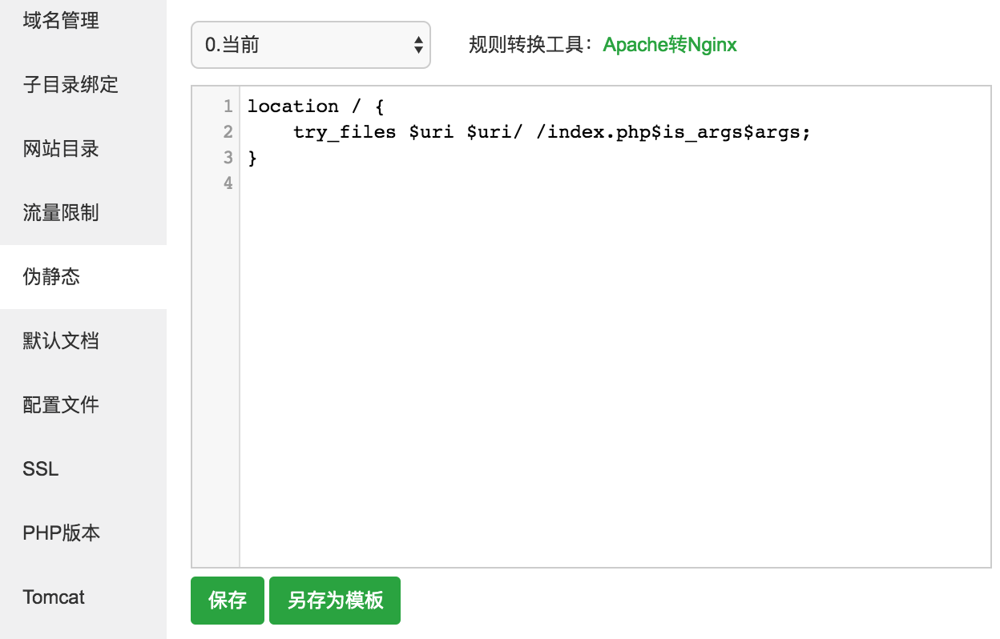
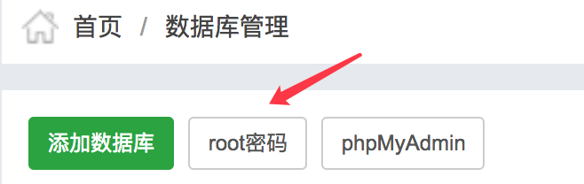

# MyVPS
VPS自建教程记录

## 从AWS获取服务器
1. 选择 Ubuntu 镜像

2. 剩余选项直接下一步
3. 配置网络安全组，启用相应端口，为简单起见直接启用全部协议和端口

4. 等待启动完成
5. 记录服务器IP
6. 按照 AWS 提示连接服务器

## 获取免费域名
1. 在 [Freenom](freenom.com) 注册登录并填写必要信息
2. 搜索一个免费域名，填入服务器IP并购买


## 安装并配置宝塔面板
1. 命令行安装
```
wget -O install.sh http://download.bt.cn/install/install-ubuntu.sh && sudo bash install.sh
```
2. 根据安装成功提示登录宝塔面板

3. 选择合适的版本安装推荐软件(耗时较长)

4. 设置宝塔面板, 尤其需要修改登录用户名和密码


## 配置 sspanel 前端
从此处开始所有的命令都在 `/www/wwwroot/自己的域名` 下执行
1. 部署前端
```
# 从自己的备份 clone sspanel 目标文件夹为 tmp
git clone https://github.com/yu961549745/ss-panel-v3-mod_Uim.git tmp 
# 移动 git 文件
mv tmp/.git . 
# 删除剩余文件
rm -rf tmp
# 利用 git 恢复所有代码
git reset --hard
```
2. 配置宝塔面板
    + 添加站点
    + 配置运行目录
    
    + 伪静态 ( 用于将 domain 映射到 domain/index.php )
    
    ```
    location / {
        try_files $uri $uri/ /index.php$is_args$args;
    }
    ```
    + 修改 MySQL 密码
    
    + 解除 PHP 禁用函数
3. 配置数据库
3. 配置项目
    + 修改 `config/.config.php`
    + 安装依赖
    ```
    php composer.phar install
    ```
    + 创建管理员账号
    ```
    php -n xcat createAdmin
    ```
    + 登录管理员账号，并在管理页面添加节点

## 配置 shadowsocks 后端
1. 利用一件安装脚本安装 shadowsocks 后端，经测试兼容 Ubuntu16.04
```
# 直接下载并运行一键安装脚本
wget https://github.com/yu961549745/ss-panel-mod-v3-backend-server-install-scripts.git
sudo chmod +x backend_install_ubuntu_18.sh 
sudo ./backend_install_ubuntu_18.sh
```
2. 输入
3. 运行测试
```
sudo python /soft/shadowsocks/server.py
```
4. 正式运行
```
sudo python /soft/shadowsocks/run.py
```
4. 宝塔面板端口放行

## 在用户面板试用节点
