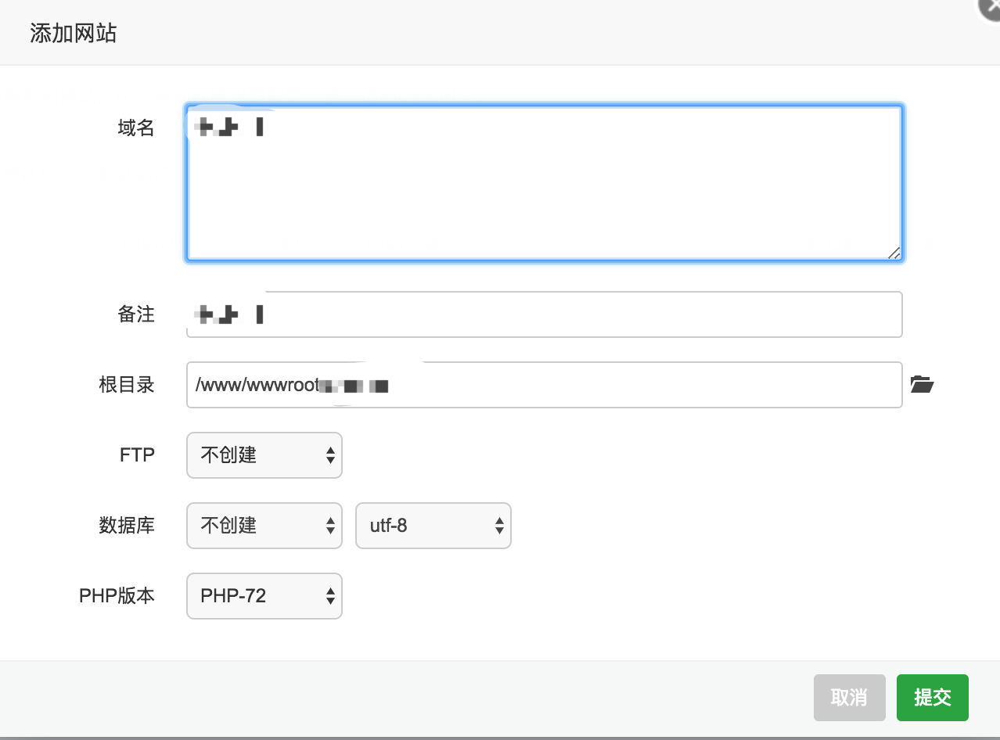
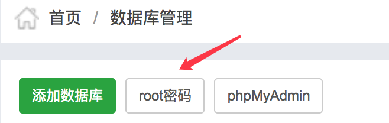
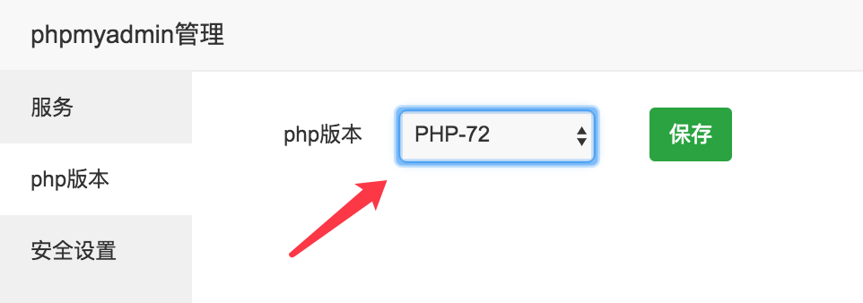
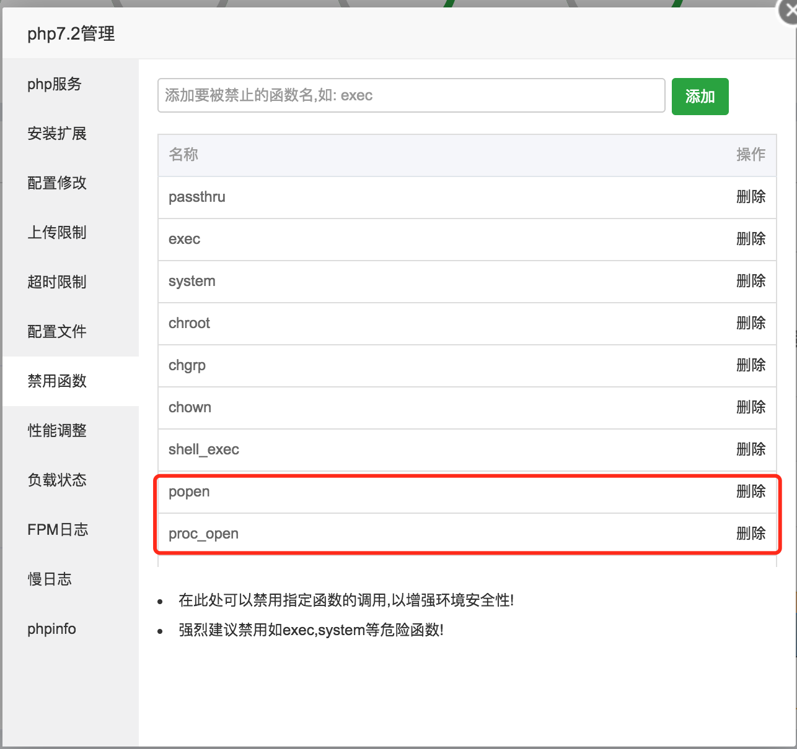
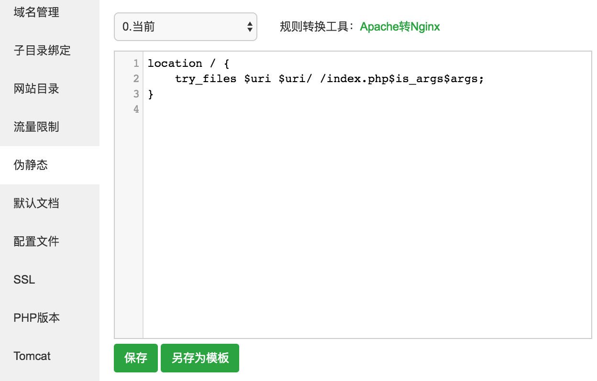
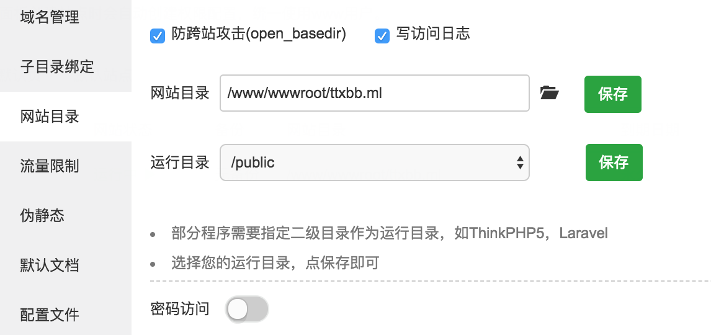
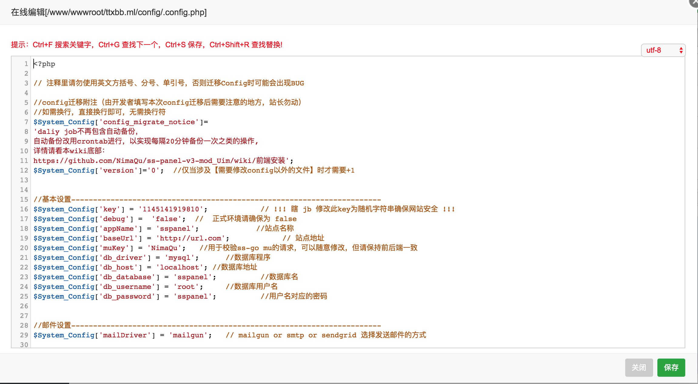
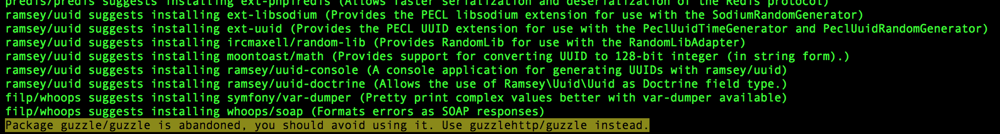
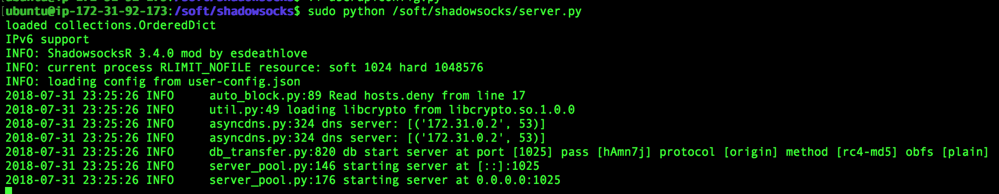

# MyVPS
VPS自建教程记录

## 从AWS获取服务器
1. 选择 Ubuntu 镜像

2. 剩余选项直接下一步
3. 配置网络安全组，启用相应端口，为简单起见直接启用全部协议和端口

4. 等待启动完成
5. 记录服务器IP
6. 按照 AWS 提示连接服务器

## 获取免费域名
1. 在 [Freenom](freenom.com) 注册登录并填写必要信息
2. 搜索一个免费域名，填入服务器IP并购买


## 安装并配置宝塔面板
1. 命令行安装
```
wget -O install.sh http://download.bt.cn/install/install-ubuntu.sh && sudo bash install.sh
```
2. 根据安装成功提示登录宝塔面板

3. 选择合适的版本安装推荐软件(耗时较长)

4. 设置宝塔面板, 尤其需要修改登录用户名和密码


## 配置 sspanel 前端
从此处开始所有的命令都在 `/www/wwwroot/自己的域名` 下执行
1. 配置宝塔面板
    + 添加站点，输入绑定域名
    
    + 修改 MySQL 密码
    
    + 检查 phpmyadmin, 如果出现 502 bad gateway, 检查配置项
    
    + 解除 PHP 禁用函数
    
2. 部署前端
```
cd /www/wwwroot/你的域名
# 开启所有权限
sudo chmod 777 .
# 从自己的备份 clone sspanel 目标文件夹为 tmp
git clone https://github.com/yu961549745/ss-panel-v3-mod_Uim.git tmp 
# 移动 git 文件
mv tmp/.git . 
# 删除剩余文件
rm -rf tmp
# 利用 git 恢复所有代码
git reset --hard
# 设置权限
sudo chmod 777 storage
```
3. 继续配置宝塔面板
    + 伪静态 ( 用于将 domain 映射到 domain/index.php )
    
    ```
    location / {
        try_files $uri $uri/ /index.php$is_args$args;
    }
    ```
    + 配置运行目录
    
4. 配置数据库
```
# 将会要求你输入密码
mysql -uroot -p
```
然后在MySQL环境中
```
create database sspanel;
source 'sql/glzjin_all.sql';
quit;
```
5. 配置项目
    + 修改 `config/.config.php`
    ```
    cd config
    cp .config.php.example .config.php
    cd ..
    ```
    按需修改基本配置
    
    + 安装依赖
    ```
    php composer.phar install
    ```
    
    + 创建管理员账号
    ```
    php -n xcat createAdmin
    ```
    + 登录管理员账号，并在管理页面添加节点
    

## 配置 shadowsocks 后端
1. 利用一件安装脚本安装 shadowsocks 后端，经测试兼容 Ubuntu16.04
```
# 直接下载并运行一键安装脚本
wget https://raw.githubusercontent.com/YihanH/ss-panel-mod-v3-backend-server-install-scripts/master/backend_install_ubuntu_18.sh
sudo chmod +x backend_install_ubuntu_18.sh 
sudo ./backend_install_ubuntu_18.sh
```
2. 输入
    + 数据库地址: localhost
    + 数据库名称: sspanel (与前端一致)
    + 数据库用户: root
    + 数据库密码: 你的密码
    + 节点编号: 3 (与控制面板一致)
3. 运行测试
```
sudo python /soft/shadowsocks/server.py
```

4. 正式运行
```
sudo /soft/shadowsocks/run.sh
```
4. 宝塔面板端口放行


## 在用户面板试用节点

## Google 学术被禁解决方案
`/etc/hosts`修改
```
2404:6800:4004:81a::200e scholar.google.cn
2404:6800:4004:81a::200e scholar.google.com.hk
2404:6800:4004:81a::200e scholar.google.com
2404:6800:4004:81a::200e scholar.l.google.com
```
