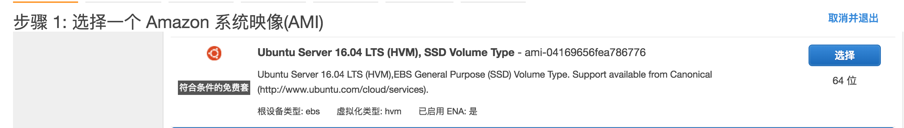
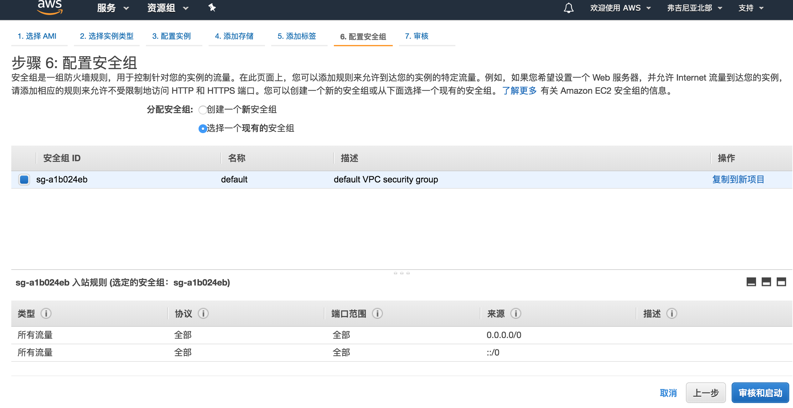
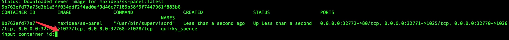
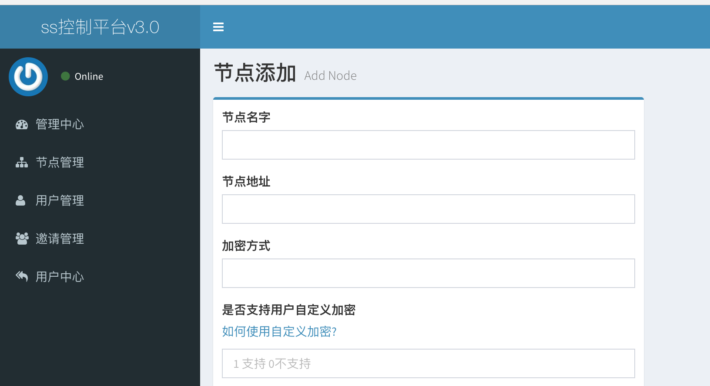

# 10分钟, 基于 docker, 一键部署 shadowsocks + sspanel v3

1. 获取服务器


2. 一键安装
```bash
wget https://raw.githubusercontent.com/yu961549745/MyVPS/master/docker-install.sh && sudo sh docker-install.sh
```

3. 配置节点


缺点: 不是 shadowsocksR + sspanel v3 mod